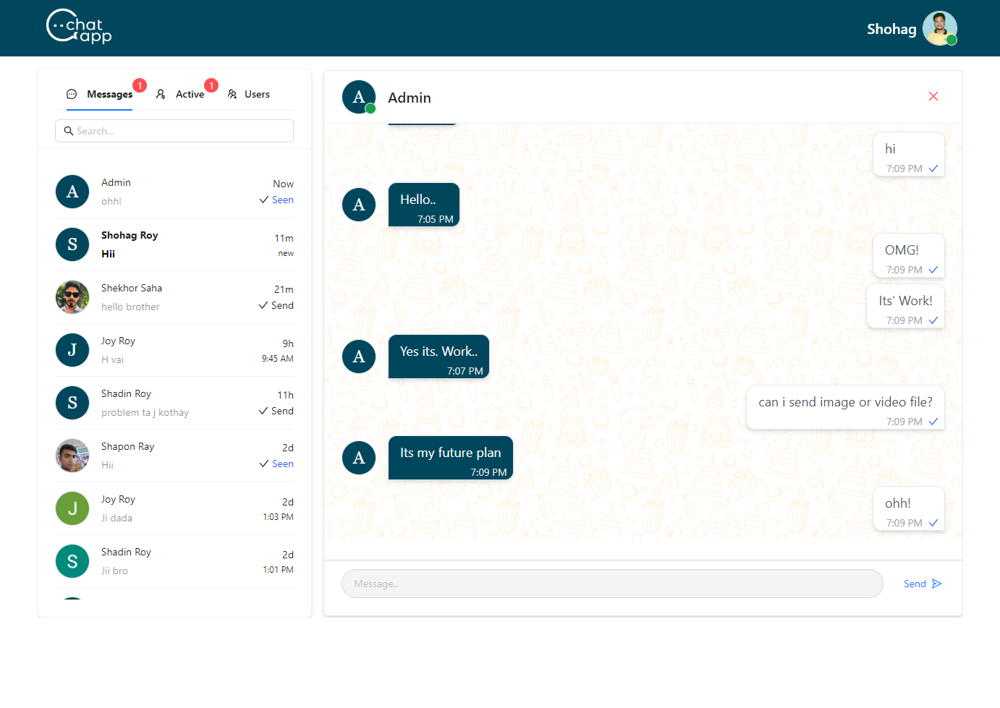
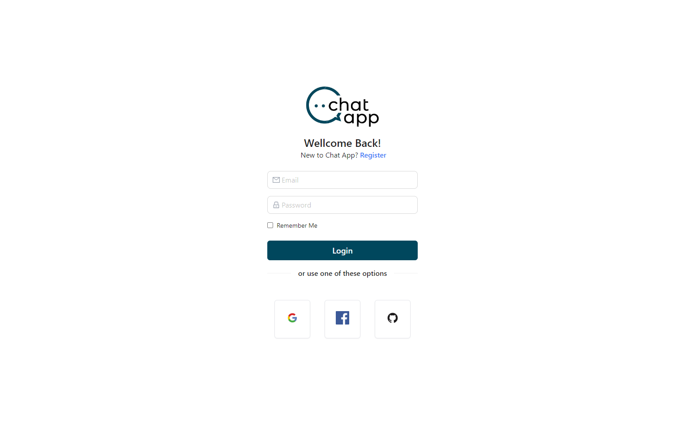
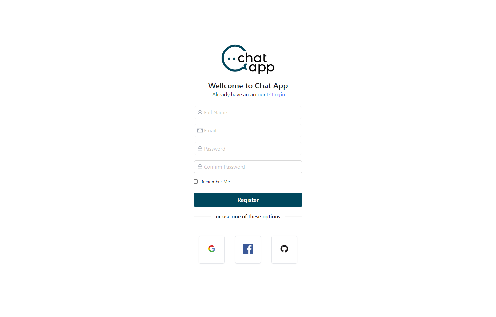

## Real Time Chat Application - Server

Project Overview

### Chat Interface



### Login Page



### Register Page



### Purpose

This project demonstrates proficiency in full-stack development, emphasizing real-time features, user authentication, and database management. It showcases the ability to create a user-friendly and dynamic web application.

- [Live Website Link](https://free-chat-application.vercel.app/)
- [Client-side Git Repo](https://github.com/shohagroy/chatting-app)
- [Server-side Git Repo](https://github.com/shohagroy/chatting-app-server)

### Technology use:

- Use JavaScript as the Programming Language.
- Use Express.js as the web framework.
- Use Socket.io as Real-time Communication
- Use MongoDB as the database

### Key Features

- **Real-time Messaging:** Users can engage in real-time with friends and contacts.

- **Online/Offline Status:** Users can see the online/offline status in all users.

- **Message Sent Status:** Users can see when a message has been successfully sent.

- **User Message Seen Status:** Users can track when their messages have been seen by the recipient.

- **Message History:** Chat history is saved for easy reference and continuity of conversations.

### Login

- **Email:** admin@gmail.com

- **Password:** 123456

### Application Routes:

#### User Route

- api/v1/users/create-update (PUT)
  Request body:

```json
{
  "id": "jObY5ii1DSVRhG39jtBXuNFHx5w1",
  "email": "admin@gmail.com",
  "name": "Admin",
  "photoURL": "url"
}
```

- api/v1/users/:id (GET) Get All User

#### Conversations Route

- api/v1/conversations (POST)
  Request body:

```json
{
  "conversationId": "jObY5ii1DSVRhG39jtBXuNFHx5w1",
  "participants": "jObY5ii1DSVRhG39jtBXuN-jObY5ii1DSVRhG39jtB",
  "users": ["user1", "user2"],
  "message": "hii",
  "isNotSeen": false
}
```

- api/v1/users/:id (GET) Get All User

- api/v1/conversations (GET) Get Participants All Conversations

- api/v1/conversations/last/jObY5ii1DSVRhG39jtBXuNFHx5w1 (GET) Get User Last All Conversations

### Security

Robust user authentication and data encryption practices ensure user data privacy.

### Future Enhancements

Future plans for the Free Chat app include:

- Message search
- Voice and video calls
- File and multimedia content sharing
- User experience enhancements
- Additional security measures

---

### Message Sent and Seen

This Application provides indicators for message delivery and seen status. Messages show two checkmarks when delivered and turn blue when seen by the recipient.

### Message Time

Each message displays a timestamp indicating when it was sent. The time format follows the standard 12-hour clock (e.g., 5:34 PM).

## License

This project is licensed under the MIT License. See the [LICENSE](LICENSE) file for details.

## Installation

1. Clone the repository.

```bash
git clone https://github.com/shohagroy/chatting-app-server.git
cd chatting-app-server


```

## Contact Information

If you have any questions or need further assistance, please feel free to contact us. We're here to help!

- **Facebook:** [Facebook](https://www.facebook.com/shohagroy.7771/)
- **Linkedin:** [Linkedin](https://www.linkedin.com/in/shohag-roy/)
- **Email:** pkshohag240@gmail.com

I hope you have a great day and enjoy exploring my Realtime Chat application!
